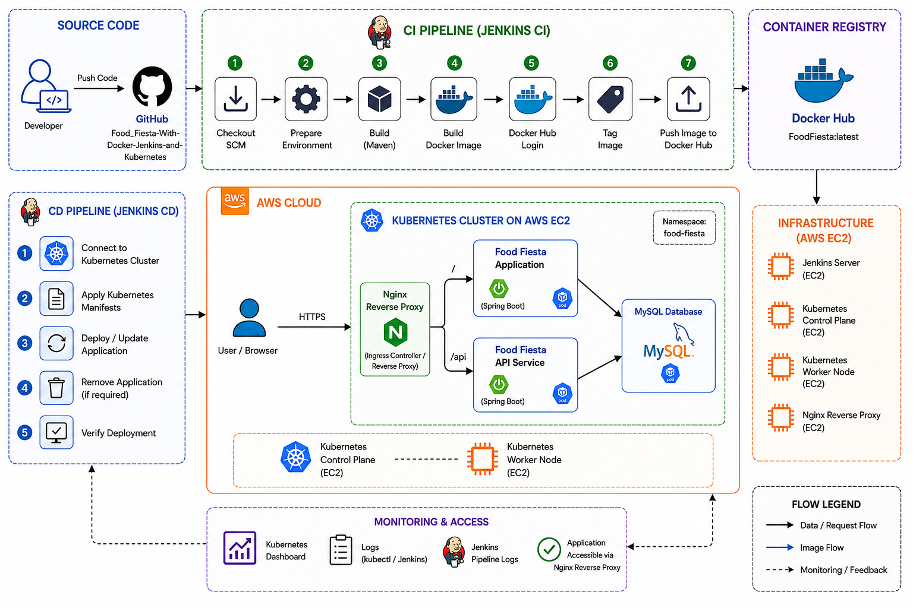

# 🍽️ Food Fiesta

## 🚀 CI/CD Deployment with Jenkins, Docker, Kubernetes, AWS EC2 & Nginx Reverse Proxy

Food Fiesta is a Spring Boot web application deployed using an end-to-end DevOps CI/CD workflow.

This project demonstrates how a Spring Boot application can be automatically built, containerized, pushed to a container registry, deployed to a self-managed Kubernetes cluster on AWS EC2, and accessed through an Nginx Reverse Proxy.

---

## 🏗️ Project Architecture



### Architecture Flow

```text
Developer
    ↓
GitHub
    ↓
Jenkins CI Pipeline
    ↓
Maven Build
    ↓
Docker Image Build
    ↓
Docker Hub
    ↓
Jenkins CD Pipeline
    ↓
Kubernetes Cluster on AWS EC2
    ↓
Spring Boot Application
    ↓
MySQL Database


Application access:

User / Browser
      ↓
Nginx Reverse Proxy
      ↓
Kubernetes Service
      ↓
Spring Boot Application
      ↓
MySQL Database


🛠️ Technologies Used
Java
Spring Boot
Maven
Git & GitHub
Jenkins
Docker
Docker Hub
Kubernetes
AWS EC2
Nginx Reverse Proxy
MySQL
Linux


